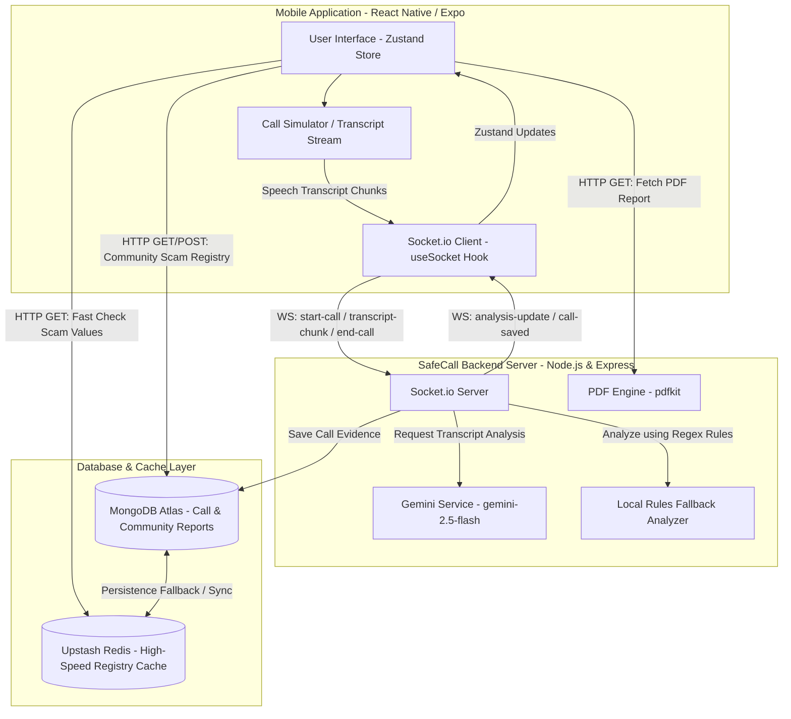
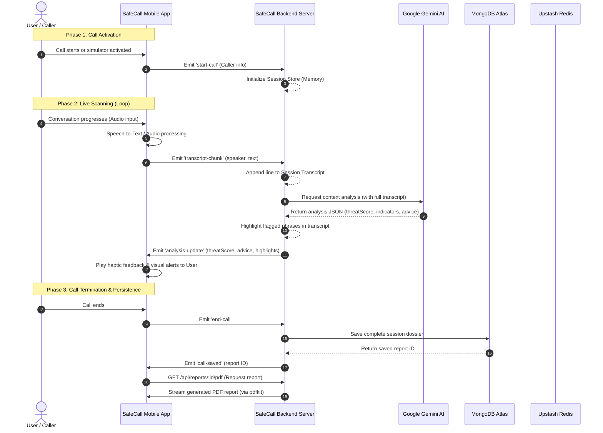

# 🛡️ SafeCall — Real-Time AI Cybersecurity Shield

<p align="center">
  <b>Stopping Digital Arrest & Cyber Scams at the "Golden Minute" — Before Financial Loss Occurs.</b>
</p>

<p align="center">
  <a href="#-the-threat-digital-arrest-scams"></a>
  <a href="#%EF%B8%8F-system-architecture"></a>
  <a href="#-live-call-workflow"></a>
  <a href="#-how-the-shield-works"></a>
</p>

---

## 🚨 The Threat: "Digital Arrest" Scams

Imagine receiving a phone call. The caller claims to be a **CBI Officer** or a **Customs Agent**. They tell you a parcel containing illegal drugs has been intercepted in your name. They threaten you with immediate arrest, order you to lock your doors, demand you keep your phone camera on, and tell you to remain in **"Digital Arrest."** 

Under psychological panic, they isolate you, forbid you from speaking to family, and finally coerce you into transferring all your savings to a "secure verification account." By the time you realize it was a scam, your funds are gone.

### 🛡️ The Defense: SafeCall

**SafeCall** intervenes during this exact window of vulnerability. With a single tap:
1. **Silent Capture**: It securely monitors the call audio.
2. **Real-Time Transcription**: Converts speech to text chunk-by-chunk.
3. **Contextual AI Analysis**: Feeds the transcript continuously to a localized, scam-trained AI model (Google Gemini 2.5 Flash).
4. **Instant Stealth Alerts**: Vibe alerts, flashing screens, and clear warnings guide the victim to hang up, without alerting the caller.
5. **Dossier Compiling**: Automatically packages the entire session, flagged sentences, caller numbers, and bank details into a structured PDF report to submit to the authorities.

---

## 🏗️ System Architecture

SafeCall utilizes a decoupled client-server architecture built on low-latency WebSockets, advanced Large Language Models, and high-performance caching layers.



---

## 🔄 Live Call Workflow

SafeCall processes ongoing calls in real-time through an asynchronous, event-driven streaming loop.



---

## ⚙️ How the Shield Works

SafeCall's safety net is divided into three key technological subsystems working in unison:

### 🧠 1. Real-Time Detection Engine
* **The WebSockets Channel**: Utilizing Socket.io, transcript text fragments are sent from the client as soon as they are captured.
* **The AI Evaluator**: The server pipes the full conversation logs to a customized prompt running on `gemini-2.5-flash`. The model evaluates:
  * **Authority Impersonation** (e.g. CBI, Police, Custom Agents, DHL).
  * **Urgency & Panic** (e.g. "Transfer funds within 20 minutes").
  * **Demands for Secrecy** (e.g. "Do not tell anyone, lock the door").
  * **Financial Transfer Triggers** (e.g. "Send money to verification accounts").
* **Local Deterministic Fallback**: In the absence of an AI connection, a regular-expression analyzer scans lines for suspicious keys. It generates a baseline score and immediate protective advice.

### ⚡ 2. High-Speed Registry Cache
* **Community Registry**: Citizens share known scam numbers, UPI IDs, and fraudulent websites via the database.
* **Fast Caching Protocol**: SafeCall implements a two-tier verification check:
  1. Checks **Upstash Redis** first (takes **<15ms**) for instant blocking decisions.
  2. Falls back to **MongoDB Atlas** regex matching. Found items are synced back to Redis to speed up future lookups.
* **Zero Configuration Run**: Out-of-the-box in-memory fallback stores enable full execution without setting up remote accounts.

### 📄 3. Evidence Dossier Compiler
* When the call terminates, the conversation state is committed. 
* SafeCall compiles a comprehensive evidence PDF utilizing server-side `pdfkit` drawing:
  * Color-coded threat severity indicators (`CRITICAL RISK`, `MODERATE RISK`, `MINOR SUSPICION`).
  * Isolated flagged sentences highlighting the exact moments of fraud.
  * Time-stamped conversation transcripts.
  * Direct filing links & instructions for cybercrime portals (Helpline 1930 / National Cybercrime Portal).

---

## 📂 Project Directory Structure

```text
SafeCall/
├── backend/                  # Node.js Server & APIs
│   ├── routes/
│   │   ├── community.js      # Registry queries, stats, and submissions
│   │   └── reports.js        # Dossier retrieval & PDF compilation
│   ├── services/
│   │   ├── geminiService.js  # Google Gemini AI prompt context & JSON schemas
│   │   └── pdfService.js     # pdfkit document compiler & layout design
│   ├── db.js                 # Mongoose schema definitions & in-memory mocks
│   ├── redis.js              # Redis REST client wrapper & memory fallback Map
│   └── server.js             # Socket.io connection coordinator & event handler
├── mobile/                   # React Native Mobile Application
│   ├── components/
│   │   ├── CallSimulator.js  # Script executor for testing scam call scenarios
│   │   └── ThreatMeter.js    # Visual progress meter displaying threat score
│   ├── hooks/
│   │   └── useSocket.js      # Socket.io client connector hook
│   ├── screens/
│   │   ├── DashboardScreen.js# General status, simulator controls, and stats
│   │   ├── LiveScannerScreen.js# Real-time transcript feed, threat meter, and advice
│   │   ├── EvidenceScreen.js # Historical dossiers viewer & PDF downloader
│   │   └── CommunityScreen.js# Scam lookup registry & reporting form
│   ├── store/
│   │   └── useScamStore.js   # Zustand state-management store
│   └── App.js                # Core app wrapper, router & socket initializers
├── package.json              # Root orchestrator package configuration
└── start-dev.js              # Orchestrator running frontend + backend concurrently
```

---

## 🛠️ Installation & Local Development

### Prerequisites
* [Node.js](https://nodejs.org/) (v18 or higher recommended)
* npm or yarn

### 1. Repository Setup
Clone the repository and install dependencies in all layers:
```bash
# Install root orchestrator packages
npm install

# Install backend dependencies
cd backend && npm install

# Install mobile dependencies
cd ../mobile && npm install
```

### 2. Environment Configuration
Create a `.env` file in the `backend/` directory:
```env
PORT=5000
GEMINI_API_KEY=your_gemini_api_key_here
MONGODB_URI=mongodb+srv://...your_mongodb_atlas_uri...
UPSTASH_REDIS_REST_URL=https://...your_upstash_redis_rest_url...
UPSTASH_REDIS_REST_TOKEN=your_upstash_redis_rest_token
```
> **Note**: If `GEMINI_API_KEY`, `MONGODB_URI`, or `UPSTASH_REDIS_REST_*` are left blank, SafeCall automatically starts in **Offline Fallback Mode** using local memory mocks, allowing you to test the app features completely locally without signing up for external accounts!

### 3. Launching the App
SafeCall includes a launch orchestrator. In the root directory, run:
```bash
npm run dev
```
This script concurrently starts:
1. **The Backend Server** on `http://localhost:5000`
2. **The Expo Dev Server** running in Web Preview Mode (opens in your default browser)

### 4. Running the Simulator
To test scam detection:
1. Open the SafeCall interface in your browser.
2. Under the **Call Simulator** on the Dashboard, select **Digital Arrest - CBI Impersonation** or **Bank Fraud**.
3. Press **Start Live Script**.
4. Navigate to the **Scanner** tab. You will see transcripts stream in real-time. Watch the threat meter adjust and display safety alerts.
5. Once the call finishes, navigate to the **Evidence** tab to view your saved dossier and download the PDF!
```,Description:
